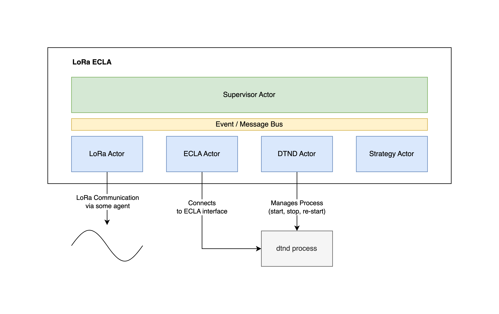

# LoRa ECLA Overlay Network

## CLI

```
LoRa ECLA 0.1.0
Daniel Schmidt <info@daniel-schmidt.de>
Configurable LoRa ECLA for dtn7-rs using Protocol Buffer overlay network.

USAGE:
    loclad [OPTIONS]

OPTIONS:
    -c, --config <config>                      Specify config file
        --create_config                        Writes default config to --config path
    -d, --debug                                Set log level to debug
        --dtnd <dtnd>                          
        --dtnd_args <dtnd_args>                
        --ecla_addr <ecla_addr>                
        --ecla_module <ecla_module>            
    -h, --help                                 Print help information
        --lora_agent <lora_agent>              
        --lora_arg <lora_arg>                  
        --strategy_config <strategy_config>    
        --strategy_name <strategy_name>        
    -V, --version                              Print version information
        --webport <webport>      
```

## Example Config File

With the ``--config,-c`` argument a json encoded config file can be used. All arguments can be overwritten via the CLI args. Priority is Default Value < Config File < CLI Argument.

```json5
{
  // LoRa Config
  "lora": {
    "agent_type": "websocket",
    "agent_arg": "127.0.0.1:8291:node1"
  },
  
  // ECLA Config
  "ecla": {
    "addr": "127.0.0.1:3000",
    "module_name": "LoRa"
  },
  
  // DTND config
  "dtnd_executable": "/some_folder/dtnd",
  "dtnd": {
    "args": "-w 3000 -r flooding -e incoming -n node1 --ecla -d -i 7s"
  },
  
  // Strategy config
  "strategy": {
    "name": "quadrant",
    "config": {
      "SEND_INTERVAL": "22s"
    }
  },
  
  // REST API webport (0 = disabled)
  "web_port": 7262
}
```

## Architecture



The system is split into different sub-systems called actors that all communicate via a central message / event bus. Each actor has different responsibilities. This makes it easy to re-configure and re-start parts of the system without interfering in others and keeping it easy to maintain as the actors are small and decoupled.

### LoRa Actor

- Starts, stops and re-starts the connection to a LoRa interface (e.g. via Serial or Websocket)
- Parses raw LoRa packets into Protocol Buffer messages and passes these to the central message bus
- Handles PingPong messages and sends response
- Passes incoming LoRa packets from the central message bus to LoRa
- Passes current GPS location to global watch

### DTND Actor

- Handles the spawning, stopping and re-starting of the dtnd process so that the ECLA can connect to it

### ECLA Actor

- Starts, stops and re-starts the connection to a ECLA interface
- Passes ECLA messages to the central message bus
- Sends incoming ECLA messages from the central message bus to the ECLA
- Passes dtnd node id to global watch

### Strategy Actor

- Starts, stops and re-starts the strategy behaviour (e.g. quadrant, random, ...)

### Supervisor Actor

- Handles the start of the full system at process start
- Handles the correct re-start order if a configuration was changed

## Routing Strategies

### random

todo

### quadrant

todo

#### Settings

- **SEND_INTERVAL**: The interval in which the strategy tries to send. (example values: 5s, 50s, 1m, 30m)
- **SPREAD_INTERVAL**: The interval in which the strategy checks for packets that should be spread again. (example values: 5s, 50s, 1m, 30m)
- **ADVERTISE_INTERVAL**: The interval in which the strategy tries to advertise the node. (example values: 5s, 50s, 1m, 30m)
- **SEND_PACKETS**: The number of packets to send when the SEND_INTERVAL is reached. (example values: 2, 5, 10)
- **SPREAD_PRIORITY**: The priority value that gets added for the spread. (example values: 5, 10, 0)
- **SELF_FORWARD_PRIORITY**: The base priority of a packet that is received from the local DTND instance. (example values: 5, 10, 0)
- **ADVERTISE_PRIORITY**: The base priority of the advertise packet. (example values: 5, 10, 0)

## REST API

todo